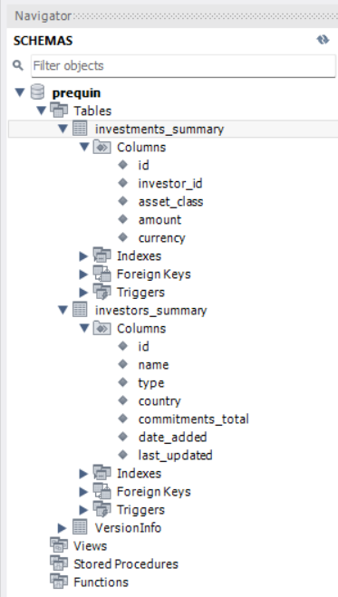
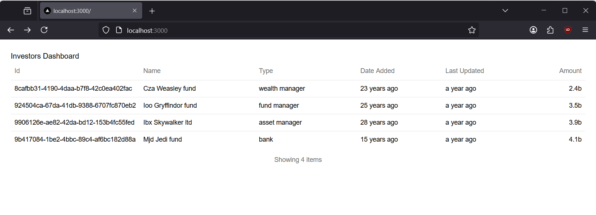
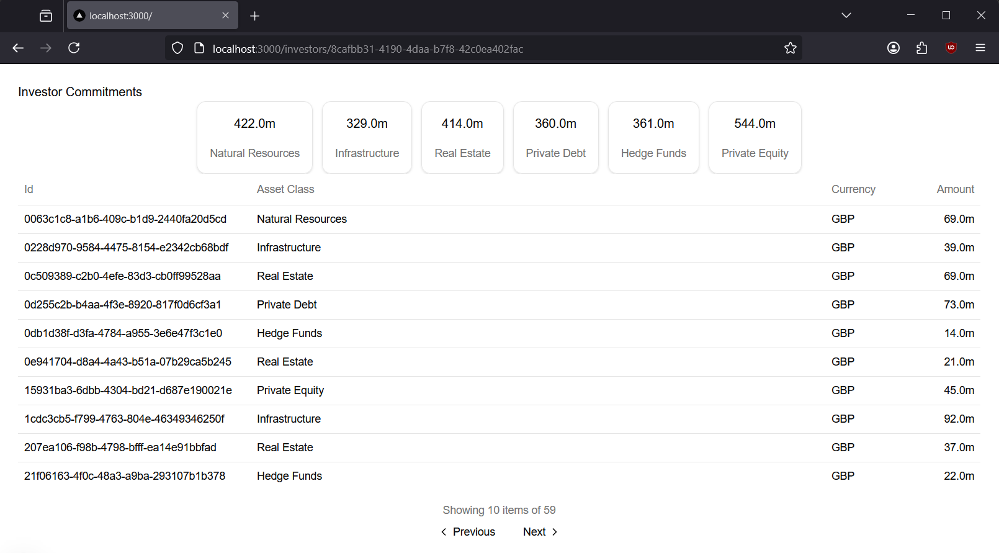

# prequin-fullstack-interview-task

Created by Alexander Williamson

There are three components:

- `website` - a [Next JS][nextjs] website
- `bff` - A Node.js / [Koa API][koa] using the [BFF pattern][bff]
- `mysql` - A mysql 8 database

And two tools:

- `migrations` - A `dotnet` mysql migrator using [Fluent migrations][fluentmigrator]
- `acceptance_tests` - A few [Playwright][playwright] acceptance tests

## Spinning up this application

> Note: I started with docker-compose but I couldn't get NextJs hot reloading working, then it broke completely. We can still benefit from consistent builds by targeting the mysql and bff parts of the docker compose file and then running the next static site separately. The advantage of using docker compose is that the environment variables are set consisntently.

- Run `docker compose`, targeting everything apart from `webite`. This spins up `mysql` and `bff`:
  - Spin up `mysql` and `bff`
  ```
  docker compose up --build mysql bff
  ```
  - Spin up `website` manually. Make sure you set the "NEXT_PUBLIC_BFF_BASE_URL" environment variable - here I use [cross-env][crossenv] for this.
  ```
  cd website
  npm ci
  cross-env NEXT_PUBLIC_BFF_BASE_URL=http://localhost:3002 npm run dev
  ```
- In a new process, migrate the database
  ```
  cd migrations
  dotnet run up
  dotnet run seed
  ```
- Then run the acceptance tests
  ```
  cd acceptance_tests
  npm ci
  npm test
  ```

To tear everything down

```
docker compose down
```

To remove everything including volumnes

```
docker compose down --volumes
```

## Database Migrations and Schemas



## Screenshots

Investors Dashboard - http://localhost:3000



Viewing Commitments for an Investor - http://localhost:3000/investors/{id}



[playwright]: "https://playwright.dev/"
[nextjs]: "https://nextjs.org/"
[koa]: "https://koajs.com/"
[bff]: "https://aws.amazon.com/blogs/mobile/backends-for-frontends-pattern/"
[fluentmigrator]: "https://fluentmigrator.github.io/"
[crossenv]: "https://www.npmjs.com/package/cross-env"
